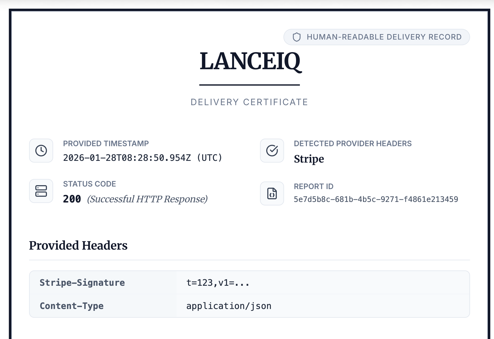
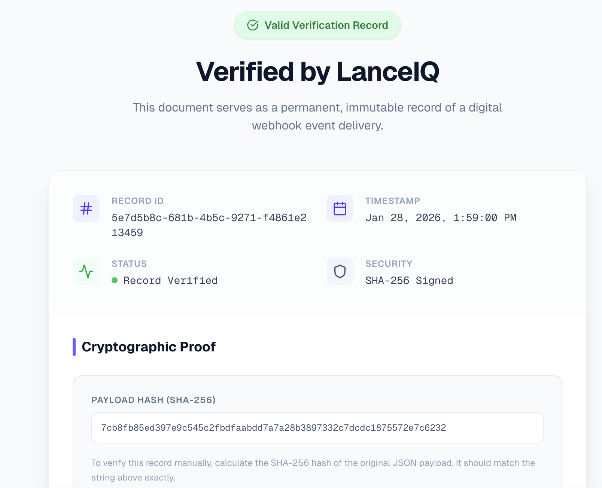

# LanceIQ

[](https://www.gnu.org/licenses/agpl-3.0)
[](https://lanceiq.com)

**Generate professional Webhook Delivery Certificates in seconds.**

LanceIQ creates official-looking PDF certificates documenting webhook deliveries. Perfect for audits, compliance, dispute resolution, and record-keeping.






## Features

- 📄 **Instant PDF Generation** — Paste JSON, get a professional certificate
- 🔒 **Privacy First** — Guest data is processed entirely in your browser and never sent to our servers
- 🏢 **Enterprise Ready** — Save certificates to your account for future reference
- ⚡ **Fast & Simple** — No complex setup, works immediately
- 🎨 **Professional Design** — Clean, audit-ready document format

## Quick Start

### Hosted Version (Easiest)
Visit [lanceiq.com](https://lanceiq.com) — no setup required.

### Self-Hosted

1. **Clone the repo**
   ```bash
   git clone https://github.com/deep1283/lanceIQ.git
   cd lanceIQ
   ```

2. **Install dependencies**
   ```bash
   npm install
   ```

3. **Set up environment**
   ```bash
   cp .env.example .env.local
   # Edit .env.local with your Supabase credentials
   ```

4. **Set up Supabase** (for auth & storage)
   ```sql
   -- Run in Supabase SQL Editor
   create table public.certificates (
     id uuid default gen_random_uuid() primary key,
     user_id uuid references auth.users(id) not null,
     created_at timestamptz default now(),
     report_id text not null,
     payload jsonb,
     headers jsonb,
     hash text,
    payload_hash text,
    is_pro boolean default false
   );

   alter table public.certificates enable row level security;

   create policy "Users can view own certificates"
     on public.certificates for select using (auth.uid() = user_id);

   create policy "Users can insert own certificates"
     on public.certificates for insert with check (auth.uid() = user_id);
   ```

5. **Run locally**
   ```bash
   npm run dev
   ```

6. **Open** [http://localhost:3000](http://localhost:3000)

## Tech Stack

- **Framework**: Next.js 16 (App Router)
- **Styling**: Tailwind CSS
- **Auth & Database**: Supabase
- **PDF Generation**: Puppeteer
- **Payments**: Dodo Payments (optional)

## Configuration

| Variable | Required | Description |
|----------|----------|-------------|
| `NEXT_PUBLIC_SUPABASE_URL` | Yes | Your Supabase project URL |
| `NEXT_PUBLIC_SUPABASE_ANON_KEY` | Yes | Supabase anonymous key |
| `SUPABASE_SERVICE_ROLE_KEY` | Yes | For public certificate verification |
| `DODO_PAYMENTS_API_KEY` | No | For watermark removal payments |
| `DODO_PAYMENTS_WEBHOOK_SECRET` | No | Dodo webhook verification |

## Contributing

Contributions are welcome! Please read our contributing guidelines before submitting PRs.

1. Fork the repo
2. Create your feature branch (`git checkout -b feature/amazing-feature`)
3. Commit your changes (`git commit -m 'Add amazing feature'`)
4. Push to the branch (`git push origin feature/amazing-feature`)
5. Open a Pull Request

## License

This project is licensed under the AGPL-3.0 License - see the [LICENSE](LICENSE) file for details.


Built with ❤️ by Deep Mishra
